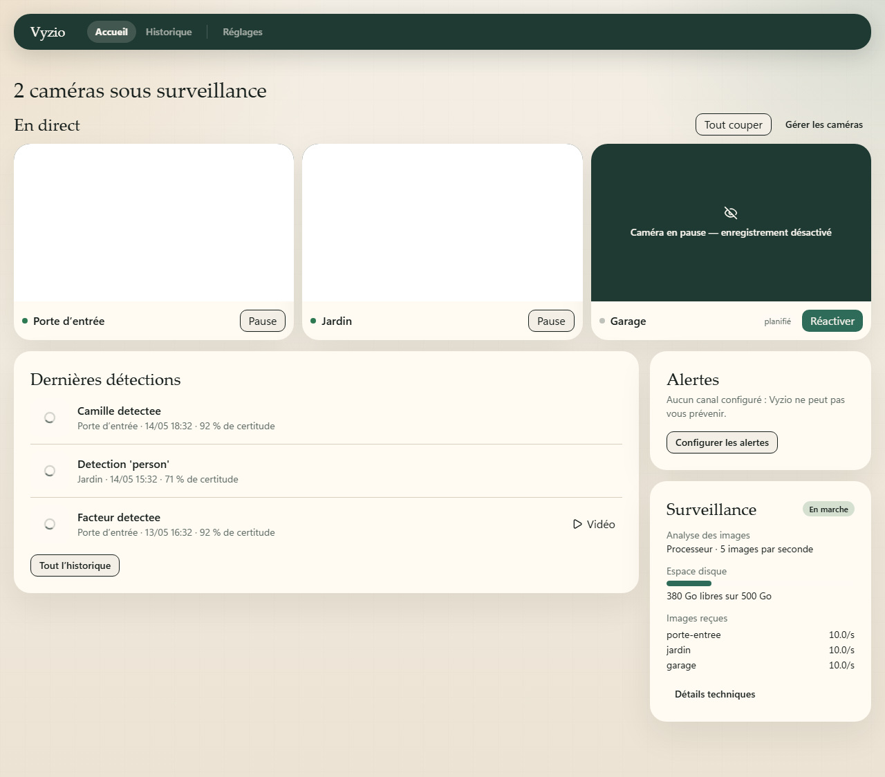
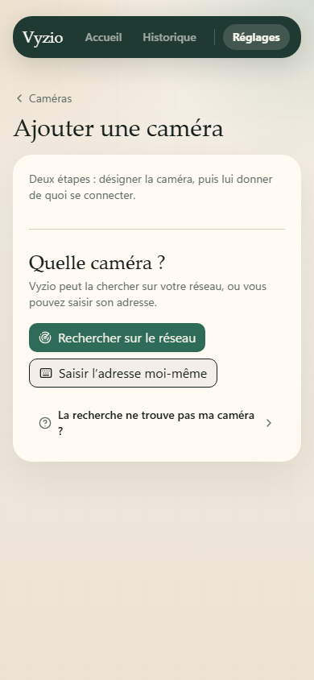
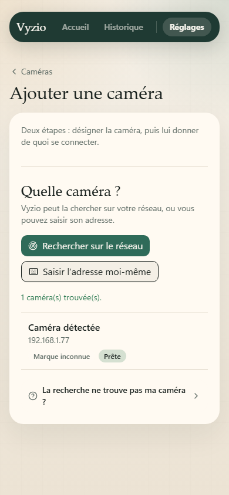
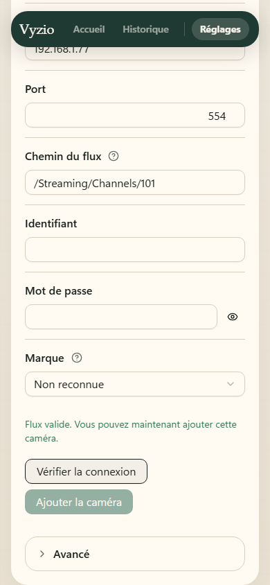
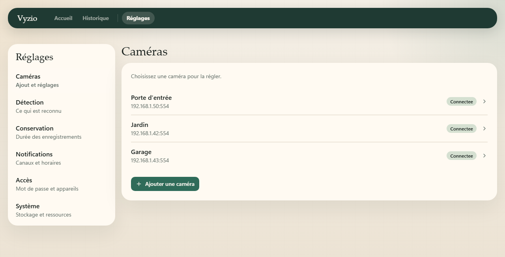
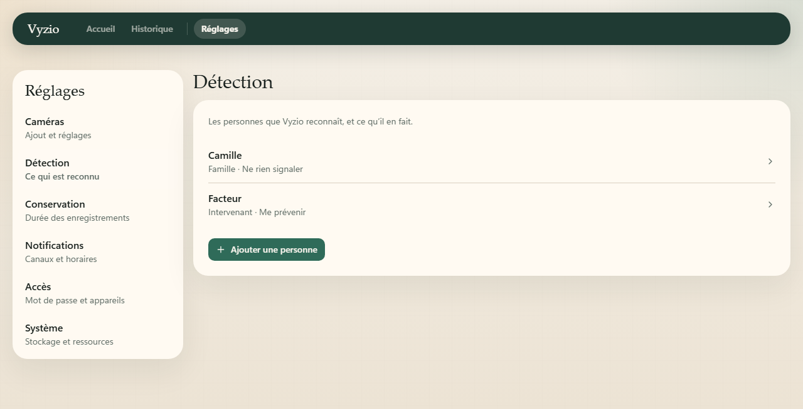

# Vyzio

> **Your home watches. Your footage stays home.**

[](https://github.com/KelianS/vyzio/actions/workflows/ci.yml)
[](https://github.com/KelianS/vyzio/actions/workflows/security.yml)
[](LICENSE)
[](https://github.com/KelianS/vyzio/actions/workflows/ci.yml)
[](https://github.com/KelianS/vyzio/actions/workflows/ci.yml)

Vyzio is self-hosted home video surveillance for people who do not want to become network
administrators. It runs on a machine you own, recognises the people who live there, and sends
you the handful of alerts that actually matter, with no cloud account, no subscription, and no
footage leaving your network.

It builds on [Frigate](https://frigate.video/) for local video analysis, and spends its own
effort on everything Frigate deliberately leaves to you: discovering the cameras already on your
network, driving them directly (PTZ, hardware privacy shutter, image settings), turning raw
detections into something a household can read, and keeping the whole thing configurable without
a YAML file in sight.

---

## A look at it



The home screen is the whole product in one page: what the cameras see, who was recognised and
when, whether alerts are going out, and what the machine is doing. One camera is on a privacy
schedule and says so.

Adding a camera: Vyzio searches the network, and asks for nothing it can find on its own.

<p>
  
  
  
</p>

Cameras, and the people the system knows about:

<p>
  
  
</p>

> Screenshots are generated from the test fixtures (`task docs:capture`), so they hold no real
> installation's data and can be regenerated whenever a screen changes. Live tiles and detection
> thumbnails show a drawn stand-in: nothing here is passed off as a scene a camera saw.

---

## Features

- **Local person recognition.** Faces are matched on your own machine, and Vyzio turns those
  signals into named, readable alerts.
- **Alerts worth reading.** Filtering and prioritisation, so a swaying branch does not wake you
  up. Every alert says why it fired.
- **Works with the IP cameras you already own.** RTSP and ONVIF, plus vendor protocols where a
  camera needs one.
- **One place to drive every camera.** PTZ, hardware privacy mode, image settings and scheduled
  privacy windows. No more one vendor app per camera.
- **Local recording.** Clips and history live on your disk, under your retention rules.
- **Offline first.** The system keeps running without internet. Notifications are delivered once
  the network comes back.
- **Guided setup.** Network discovery finds the cameras, and the interface walks through the
  rest. No configuration file to hand-write.

---

## Cameras

**Any RTSP or ONVIF camera can be added**, by discovery or by typing its address. Beyond the video
stream, the brands below are recognised on sight and arrive pre-configured, because Vyzio already
knows how to drive them:

| Brand            | Privacy mode                       | Move the camera | Image settings                    |
| ---------------- | ---------------------------------- | --------------- | --------------------------------- |
| TP-Link Tapo     | Hardware cut, lens covered, LED off | Yes             | Not yet                           |
| ICSee / XMEye    | Turns away and stops recording      | Yes             | Brightness, contrast, saturation  |
| V380 PRO         | Turns away and stops recording      | Yes             | Not confirmed on the tested units |

A **hardware cut** means Vyzio asks the camera's own firmware to close the shutter and kill the
sensor, so nothing is filmed at all. Where a camera offers no such thing, Vyzio physically turns it
to a wall and stops recording at the same time.

Nothing in that table is taken on trust: a capability is probed on the camera itself before Vyzio
offers it, and a failed probe hides that one control without affecting the others. The list grows
one brand at a time, and the full detail, protocol by protocol, is in
[`src/vyzio/vendors/README.md`](src/vyzio/vendors/README.md).

---

## Why not Ring, Nest or Arlo

|                                    | Ring / Nest / Arlo | Vyzio  |
| ---------------------------------- | :----------------: | :----: |
| Footage stored on hardware you own |         ✗          |   ✓    |
| Recognition runs locally           |         ✗          |   ✓    |
| Works without internet             |         ✗          |   ✓    |
| Open source                        |         ✗          |   ✓    |
| Third-party IP cameras             |      limited       |   ✓    |
| Mandatory subscription             |         ✓          |  none  |

Vyzio is developed both as an open-source project and as a pre-configured appliance sold with
French-language support. This repository is the open-source side, and carries no support
commitment.

---

## Quick start

> **Requirements.** Linux with Docker Engine 25+ and Docker Compose v2.

```bash
curl -O https://raw.githubusercontent.com/KelianS/vyzio/main/docker-compose.yml
docker compose up -d
```

Open `http://<SERVER_IP>:8080`. Vyzio first asks you to choose a password, which guards the
interface and therefore the cameras. Everything else is configured from there.

To update:

```bash
docker compose pull
docker compose up -d
```

### Configuration

Every value ships with a production-ready default. Override through `VYZIO_*` variables in
`docker-compose.yml`:

| Variable                      | Default               | Description                                             |
| ----------------------------- | --------------------- | ------------------------------------------------------- |
| `VYZIO_TIME_ZONE`             | system TZ             | IANA time zone, e.g. `Europe/Paris`                      |
| `VYZIO_DISCOVERY_PROBE_CIDRS` | *(none)*              | Network range scanned for cameras, e.g. `192.168.1.0/24` |
| `VYZIO_FRIGATE_API_BASE_URL`  | `http://frigate:5000` | Internal Frigate URL; leave alone outside custom deploys |

Full list in [`CONTRIBUTING.md`](CONTRIBUTING.md).

### Recommended hardware

|         | Minimum | Recommended                    |
| ------- | :-----: | :----------------------------: |
| CPU     | 4 cores | 6+ cores                       |
| RAM     | 4 GB    | 8 GB                           |
| Storage | 32 GB   | 500 GB+ (depends on retention) |

> Detection is CPU-hungry. A dedicated NPU or GPU makes a large difference past two or three
> cameras.

### Locked out

There is no recovery email and no online account, so nobody but you can reopen an installation.
The only way back in is the machine hosting Vyzio:

```bash
docker compose exec vyzio-api dotnet Vyzio.Api.dll reset-password
```

The command **removes** the password and closes every open session. It does not ask for a new
one, which would otherwise sit in your shell history. Vyzio then reopens on the password-choice
screen for **30 minutes**, with cameras, settings and history untouched. After that it locks
itself again, and the command has to be run once more.

> During those 30 minutes, anyone who can reach the interface on the local network can claim the
> password. Run the command when you are ready to type one.

Changing a password you still know needs none of this: Settings › Access, in the interface.

---

## Under the hood

.NET 10 and EF Core on the backend, React 19 with TypeScript and Vite on the frontend, Frigate for
video analysis, the whole thing running under Docker Compose. Tests are xUnit, Vitest and
Playwright; `Taskfile.yml` at the root drives both sides.

Both sides follow the same clean architecture, cut into vertical slices whose folders carry the
same names. The layout and its boundaries are in [`docs/SAD.md`](docs/SAD.md), every structural
decision and the options rejected with it in [`docs/adr/`](docs/adr/), and how to run it in
[`CONTRIBUTING.md`](CONTRIBUTING.md).

---

## Project status

Vyzio is under **active development** and not yet released publicly. Cameras, detection, person
recognition, notifications, live view, clips and history all work today, and the production
plumbing (CI, Docker images, Compose deployment) is in place.

What is still missing before a public release is tracked in the
[issues](https://github.com/KelianS/vyzio/issues), notably encrypted transport, per-camera areas
of interest, and data export and erasure.

---

## Contributing

Contributions are welcome. Setup, tasks and environment variables are in
[`CONTRIBUTING.md`](CONTRIBUTING.md). The process, meaning how a change is framed before it is
written, is in [`docs/WORKFLOW.md`](docs/WORKFLOW.md).

Documentation is French where it frames the product for its market (`docs/SPECS.md`).
Everything else is English: code, comments, commits, pull requests, issue titles.

---

## Documentation

| Document                                           | What it holds                            |
| -------------------------------------------------- | ---------------------------------------- |
| [`docs/SPECS.md`](docs/SPECS.md)                   | What the product does, and for whom      |
| [`docs/SAD.md`](docs/SAD.md)                       | Architecture, boundaries, target state   |
| [`docs/adr/`](docs/adr/)                           | Structural decisions and their rationale |
| [`docs/design/`](docs/design/)                     | How individual components work           |
| [`docs/DESIGN SYSTEM.md`](docs/DESIGN%20SYSTEM.md) | Interface tokens, components and intent  |
| [`docs/WORKFLOW.md`](docs/WORKFLOW.md)             | Process and documentation governance     |

User documentation lives inside the interface, on the screen it belongs to
([ADR-53](docs/adr/0053-user-documentation-lives-in-the-interface-three-levels-of-help.md)).

---

## License

[AGPL-3.0](LICENSE).
