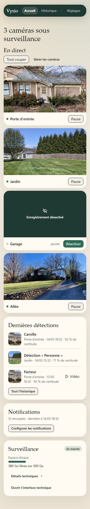
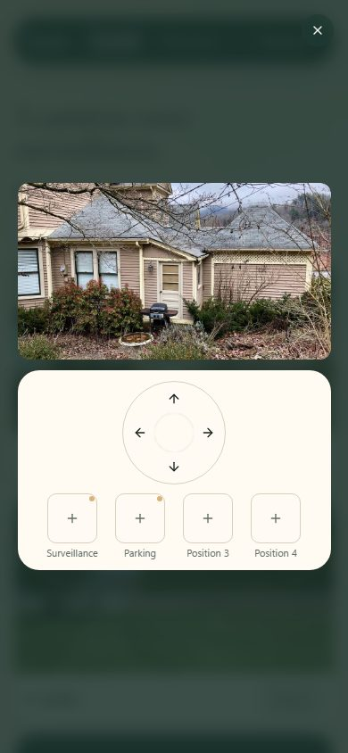
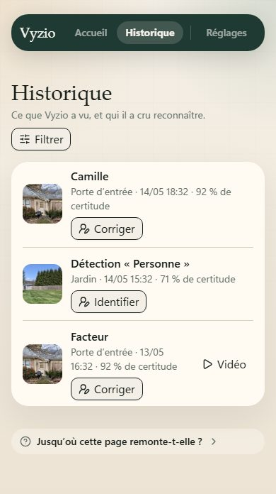
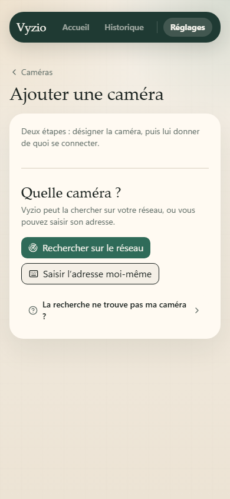
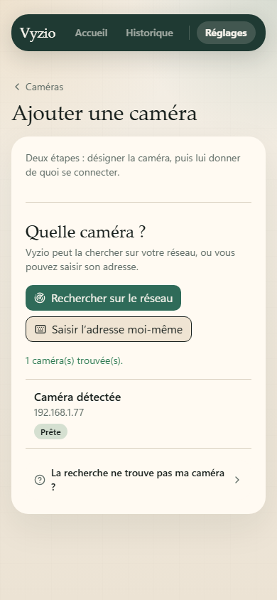
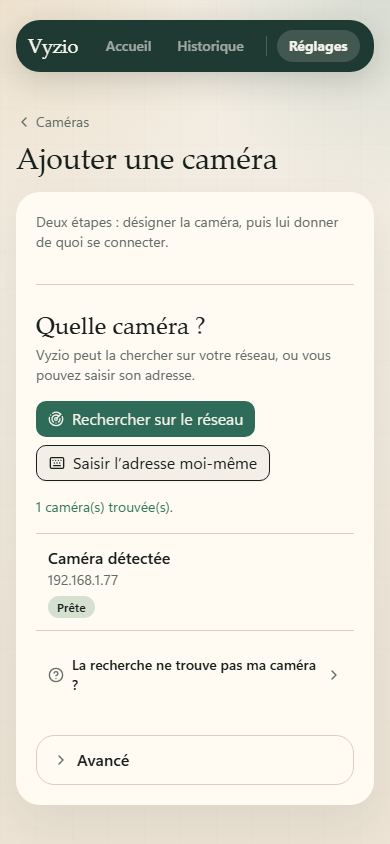
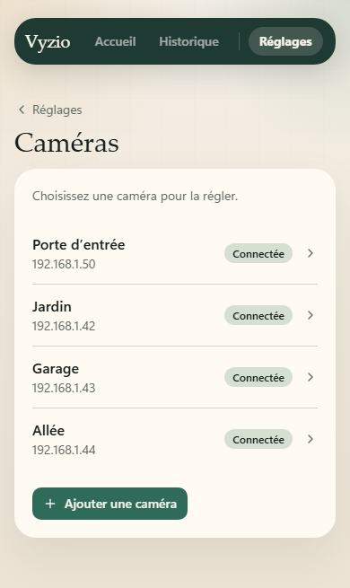
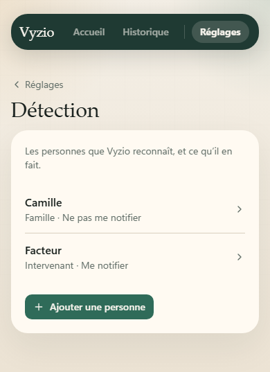

# Vyzio

> **Your home watches. Your footage stays home.**

[](https://github.com/KelianS/vyzio/actions/workflows/ci.yml)
[](https://github.com/KelianS/vyzio/actions/workflows/security.yml)
[](LICENSE)
[](https://github.com/KelianS/vyzio/actions/workflows/ci.yml)
[](https://github.com/KelianS/vyzio/actions/workflows/ci.yml)

Vyzio is self-hosted home video surveillance for people who do not want to become network
administrators. It runs on a machine you own, recognises the people who live there, and sends
you the handful of notifications that actually matter, with no cloud account, no subscription, and
nothing leaving your network unless you chose to send it.

It builds on [Frigate](https://frigate.video/) for local video analysis, and spends its own
effort on everything Frigate deliberately leaves to you: discovering the cameras already on your
network, driving them directly (PTZ, hardware privacy shutter, image settings), turning raw
detections into something a household can read, and keeping the whole thing configurable without
a YAML file in sight.

---

## A look at it

Designed for the phone first. The home screen holds the whole product: what the cameras see, who
was recognised and when, whether notifications go out, and how the machine is doing. A tap on a
camera opens its live view, and steers it when the camera can move.

<p>
  
  
  
</p>

Adding a camera: Vyzio searches the local network (the subnet the interface is opened from, plus
the ranges you give it), then asks only for the camera's access.

<p>
  
  
  
</p>

<p>
  
  
</p>

> Generated on the test fixtures by `task docs:capture`: no real installation's data. The camera
> images are royalty-free stock scenes, with their sources in
> [`tests/e2e/fixtures/scenes/`](src/dashboard/tests/e2e/fixtures/scenes/README.md).

---

## Features

- **Local person recognition.** Faces are matched on your own machine, and a detection names who
  was seen.
- **Notifications worth reading.** You choose which people and which cameras notify you, and
  through which channel.
- **Works with the IP cameras you already own.** RTSP and ONVIF, plus vendor protocols where a
  camera needs one.
- **One place to drive every camera.** Movement, privacy mode, image settings and privacy
  schedules. No more one vendor app per camera.
- **Local recording.** Clips and history live on your disk, under your retention rules.
- **Offline first.** Everything keeps running without internet except notifications, and one that
  fails while the network is down is not sent again.
- **Guided setup.** Network discovery finds the cameras. No configuration file to hand-write.

---

## Cameras

**Any RTSP or ONVIF camera can be added**, by discovery or by typing its address. Beyond the video
stream, Vyzio also speaks the proprietary protocols of a few brands, and detects what each camera
can do the same way whatever its brand: it reads the proof from the camera, or, where none can be
read, asks you to try the capability once and say whether it worked. The brand only picks a help
sheet: what to prepare in the vendor app first ([`src/vyzio/vendors/`](src/vyzio/vendors/README.md)).

Brands whose own protocols Vyzio speaks:

| Camera        | Privacy mode                   | Move the camera | Image settings                      |
| ------------- | ------------------------------ | --------------- | ----------------------------------- |
| TP-Link Tapo  | Turns away and stops recording | Yes             | Brightness, contrast, sharpness, IR |
| ICSee / XMEye | Turns away and stops recording | Yes             | Brightness, contrast, saturation    |
| V380 PRO      | Turns away and stops recording | Yes             | Not confirmed on the tested units   |

A camera whose firmware can cut its own sensor is asked to, so nothing is filmed at all. Otherwise
Vyzio turns it to the parking position you saved, stops recording, and turns it back afterwards.

---

## Why not Ring, Nest or Arlo

|                                    | Ring / Nest / Arlo | Vyzio  |
| ---------------------------------- | :----------------: | :----: |
| Footage stored on hardware you own |         ✗          |   ✓    |
| Recognition runs locally           |         ✗          |   ✓    |
| Works without internet             |         ✗          |   ✓    |
| Open source                        |         ✗          |   ✓    |
| Third-party IP cameras             |      limited       |   ✓    |
| Mandatory subscription             |         ✓          |  none  |

Vyzio is developed both as an open-source project and as a pre-configured appliance sold with
French-language support. This repository is the open-source side, and carries no support
commitment.

---

## Quick start

> **Requirements.** Linux with Docker Engine 25+ and Docker Compose v2.

```bash
curl -O https://raw.githubusercontent.com/KelianS/vyzio/main/docker-compose.yml
docker compose up -d
```

Open `http://<SERVER_IP>:8080`. Vyzio first asks you to choose a password, which guards the
interface and therefore the cameras. Everything else is configured from there.

To update:

```bash
docker compose pull
docker compose up -d
```

### Configuration

Every value ships with a production-ready default. The `VYZIO_*` variables that override one in
`docker-compose.yml`, such as the time zone, are listed in [`CONTRIBUTING.md`](CONTRIBUTING.md).

### Recommended hardware

|         | Minimum | Recommended                    |
| ------- | :-----: | :----------------------------: |
| CPU     | 4 cores | 6+ cores                       |
| RAM     | 4 GB    | 8 GB                           |
| Storage | 32 GB   | 500 GB+ (depends on retention) |

> Detection is CPU-hungry. A dedicated NPU or GPU makes a large difference past two or three
> cameras.

### Locked out

There is no recovery email and no online account, so nobody but you can reopen an installation.
The only way back in is the machine hosting Vyzio:

```bash
docker compose exec vyzio-api dotnet Vyzio.Api.dll reset-password
```

The command **removes** the password (a new one would sit in your shell history) and closes every
session. Vyzio then offers the password choice for a limited time, cameras, settings and history
untouched, then locks itself again
([ADR-54](docs/adr/0054-interface-access-guarded-by-an-owner-account-server-session-in-a-cookie.md)).

> Meanwhile, anyone on the local network can claim the password: run the command when you are
> ready to type one.

A password you still know changes in the interface: `Réglages › Accès`.

---

## Under the hood

.NET 10 and EF Core on the backend, React 19 with TypeScript and Vite on the frontend, Frigate for
video analysis, the whole thing running under Docker Compose. Tests are xUnit, Vitest and
Playwright; `Taskfile.yml` at the root drives both sides.

Both sides follow the same clean architecture, cut into vertical slices whose folders carry the
same names. The system's containers, flows and data are in [`docs/SAD.md`](docs/SAD.md), every
structural decision and the options rejected with it in [`docs/adr/`](docs/adr/), and how to run it in
[`CONTRIBUTING.md`](CONTRIBUTING.md).

---

## Project status

Vyzio is under **active development**, and its version numbers say so: releases are `0.x`, and a
screen can still move between two of them. Cameras, detection, person recognition, notifications,
live view, clips and history all work today, and the production plumbing (CI, Docker images,
Compose deployment) is in place.

What a 1.0 still waits on is tracked in the
[issues](https://github.com/KelianS/vyzio/issues), notably
[per-camera areas of interest](https://github.com/KelianS/vyzio/issues/68) and
[data export and erasure](https://github.com/KelianS/vyzio/issues/69). Access from outside the home
is not delivered yet. Read [`SECURITY.md`](SECURITY.md) before deploying: the home network is
served in the clear, by design.

---

## Contributing

Contributions are welcome. Setup, tasks and environment variables are in
[`CONTRIBUTING.md`](CONTRIBUTING.md). The process, meaning how a change is framed before it is
written, is in [`docs/WORKFLOW.md`](docs/WORKFLOW.md). Taking part means keeping to the
[code of conduct](CODE_OF_CONDUCT.md).

Found a security flaw? Do not open an issue: [`SECURITY.md`](SECURITY.md) says how to report it
privately, and what Vyzio does and does not defend against today.

Documentation is French where it frames the product for its market (`docs/SPECS.md`).
Everything else is English: code, comments, commits, pull requests, issue titles.

---

## Documentation

| Document                                           | What it holds                            |
| -------------------------------------------------- | ---------------------------------------- |
| [`docs/SPECS.md`](docs/SPECS.md)                   | What the product does, and for whom      |
| [`docs/SAD.md`](docs/SAD.md)                       | System overview, flows, data, threats    |
| [`docs/adr/`](docs/adr/)                           | Structural decisions and their rationale |
| [`docs/hardware/`](docs/hardware/)                 | Measurements of each camera model        |
| [`docs/DESIGN SYSTEM.md`](docs/DESIGN%20SYSTEM.md) | Interface tokens, components and intent  |
| [`docs/WORKFLOW.md`](docs/WORKFLOW.md)             | Process and documentation governance     |

User documentation lives inside the interface, on the screen it belongs to
([ADR-53](docs/adr/0053-user-documentation-lives-in-the-interface-three-levels-of-help.md)).

---

## License

[AGPL-3.0](LICENSE).
