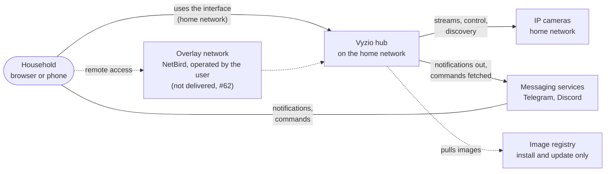
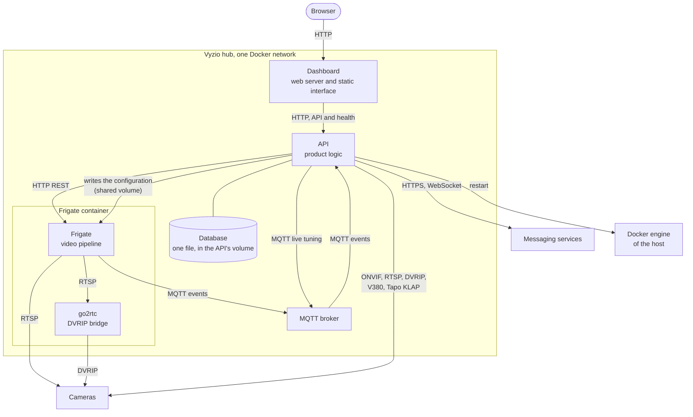
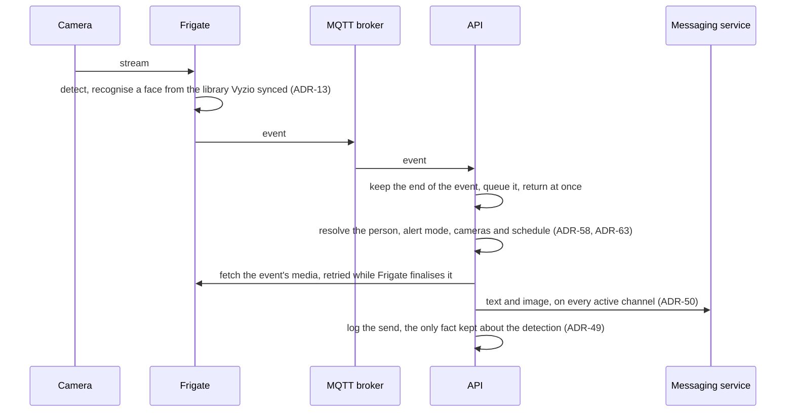
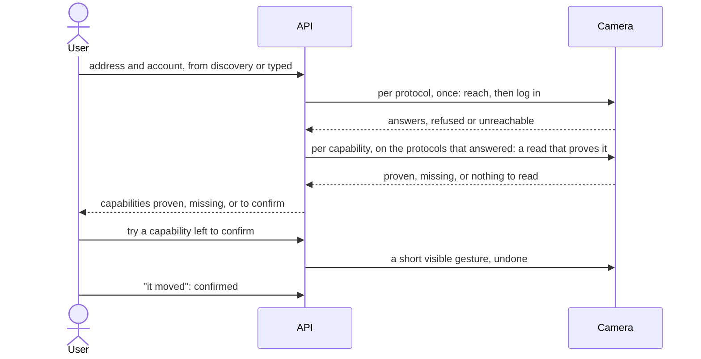
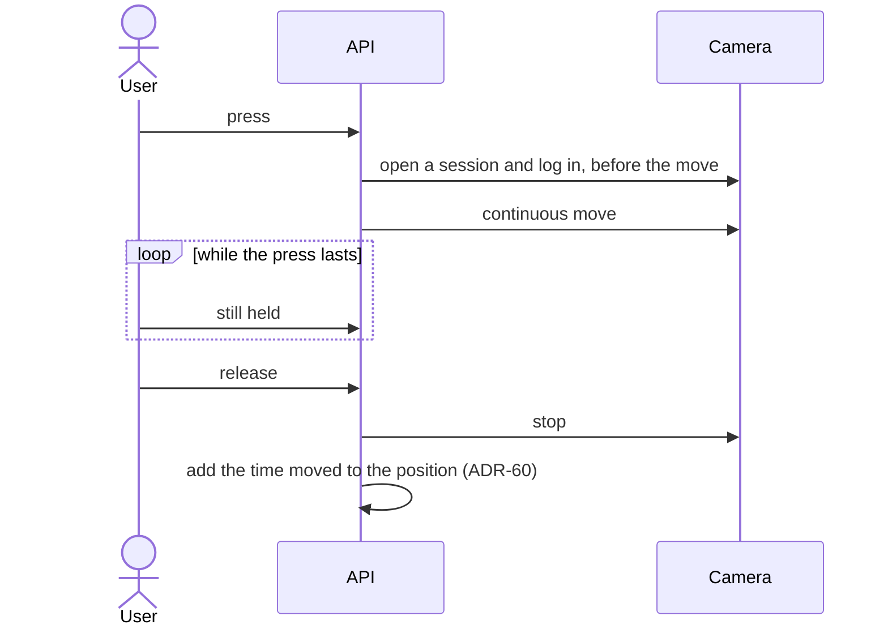
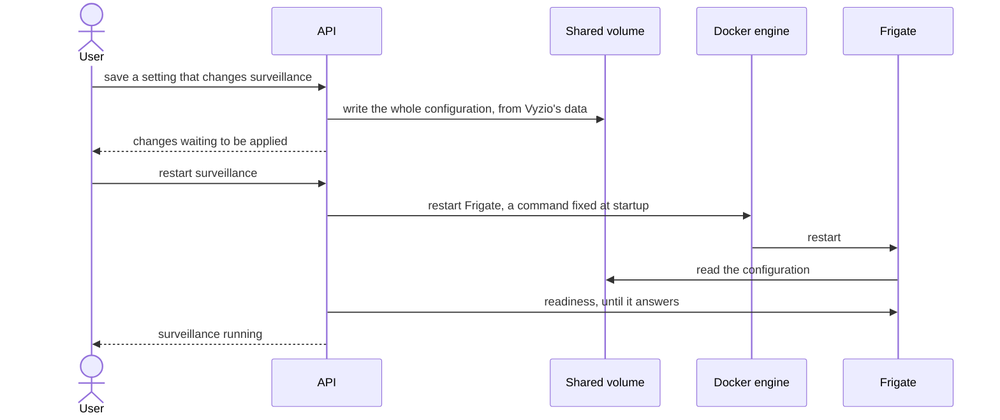

# Vyzio, Software Architecture Document (SAD)

The overview of the system: what runs, what talks to what, where the data lives and what threatens it.
It holds what the code does not easily show. Each decision is an ADR, named here by its number
([index](adr/README.md)); how a part works is in the code and its tests. What this document may and
may not hold, and when it must change: [`WORKFLOW.md`](WORKFLOW.md) § The SAD.

Vyzio is a product layer on top of Frigate (ADR-01): Frigate runs the video pipeline, Vyzio makes it
usable by a non-technical household and keeps it invisible.

---

## 1. Quality attributes

| Attribute | Requirement | Architectural impact | Answered by |
|---|---|---|---|
| Privacy | No image and no biometric data leaves the house without explicit consent ([SPECS](SPECS.md) 8.2) | Everything that sees an image runs on the hub, and Frigate is never reachable directly. Outbound, only the channels the user configured carry an image; Frigate's own version check and model download remain (§ 4, #250) | ADR-03, ADR-16, ADR-17, ADR-49, ADR-50 |
| Offline | Detection, recording, history and the interface work without internet ([SPECS](SPECS.md) 5.3) | No cloud service in any critical path; the messaging channels and remote access need internet, and face recognition once, for its models (#250) | ADR-01, ADR-06, ADR-09 |
| Target hardware | A modest machine at home: a mini PC, a Raspberry Pi 5, a NAS | One Compose stack, one database file, the detector picked from the hardware found, with a CPU fallback | ADR-06, ADR-34, ADR-37 |
| Latency | A person signalled while still in view | Vyzio adds no step on the image path: detection and recognition stay in Frigate, Vyzio reacts to its events and fetches the media afterwards | ADR-03, ADR-04 |
| Plug and play | No YAML, no network or protocol knowledge ([SPECS](SPECS.md) 1.3) | Vyzio writes and applies the whole Frigate configuration; cameras are reached through five protocols, their capabilities detected and proven, whatever the brand | ADR-12, ADR-22, ADR-28, ADR-44, ADR-61 |
| Resilience | A lost camera or a restarting Frigate is visible, never silent ([SPECS](SPECS.md) 2.2) | The API stays alive while Frigate restarts; camera reachability is watched apart from Frigate; Vyzio observes and shows, it never removes or reloads a camera on its own | ADR-23, ADR-55 |
| Diagnosable errors | A plain sentence, then the detail support needs ([SPECS](SPECS.md) 1.5) | A camera that refuses is told apart from one that cannot be reached, from the protocol client up to the screen | ADR-56 |

---

## 2. Context (C4 level 1)

The hub is the only thing the user reaches at home. Away from home, the messaging channel is the
everyday path (ADR-50); remote access to the interface is optional and goes through an overlay
network the user operates, never through an open port (ADR-51).

---

## 3. Containers (C4 level 2)

| Container | Responsibility | Does not | Shaped by |
|---|---|---|---|
| Dashboard | Serves the interface and relays the API and the liveness probe; the only service published to the user | Hold state, reach Frigate or a camera | ADR-08, ADR-40, ADR-42, ADR-53, ADR-55 |
| API | The product: cameras (protocols, capabilities, streams, PTZ, privacy), the Frigate configuration and its application, profiles, notifications and commands, history read from Frigate, the owner account and sessions; the one authentication boundary | Decode video, detect, record, or keep a detection | ADR-04, ADR-07, ADR-12, ADR-22, ADR-49, ADR-50, ADR-54, ADR-61 |
| Database | Vyzio's own data (§ 6) | Hold a detection, a frame or an embedding | ADR-06, ADR-49 |
| MQTT broker | The event bus between Frigate and Vyzio | Leave the Docker network, persist anything | ADR-04, ADR-35 |
| Frigate | Ingests the streams, detects, recognises faces, records, keeps clips and events, serves frames and media to the API | Get reached by the user, decide what is signalled, hold Vyzio's data | ADR-01, ADR-03, ADR-34, ADR-37, ADR-39 |
| go2rtc (inside the Frigate container) | Turns a DVRIP camera into a stream Frigate reads like any other | Get configured by the user | ADR-19 |

---

## 4. Network flows

Every flow the system opens. "Docker network" means a flow that never leaves the hub.

| Source | Direction | Destination | Protocol | Port | Authentication |
|---|---|---|---|---|---|
| Browser, home network | to | Dashboard | HTTP, in the clear (#67) | 8080, the one published port | Owner session cookie (ADR-54) |
| Dashboard | to | API, Docker network | HTTP | 8443 | The owner session cookie, passed through |
| API | to | Frigate, Docker network | HTTP REST | 5000, also bound to the host's loopback | None: unreachable from outside the hub |
| Frigate | to | MQTT broker, Docker network | MQTT | 1883 | None, anonymous |
| API | to and from | MQTT broker, Docker network | MQTT: subscribes to events, publishes live tuning | 1883 | None, anonymous |
| Frigate | to | Camera | RTSP | 554 by default, set per camera | Camera account, written in the generated configuration |
| go2rtc | to | Camera | DVRIP | 34567 by default, set per camera | Camera account, DVRIP login |
| Frigate | to | go2rtc, inside its container | RTSP | 8554, loopback | None |
| API | to | Camera | ONVIF (SOAP over HTTP) | Asked of the camera, swept over the usual ONVIF ports when unknown (ADR-56) | WS-Security digest; the search for the endpoint presents no account |
| API | to | Camera | RTSP, stream checks | 554 by default, set per camera | Basic or Digest when challenged |
| API | to | Camera | DVRIP | 34567 by default, set per camera | DVRIP login |
| API | to | Camera | V380 | TCP 8800 by default; UDP 10008 to find the device number, to the camera then its subnet broadcast | V380 handshake with the device number |
| API | to | Camera | Tapo KLAP over HTTP | 80 by default, set per camera | KLAP handshake with the Tapo cloud account, presented to the camera only (ADR-61) |
| API | to | Home network, discovery | ICMP, TCP connect, reverse DNS; WS-Discovery multicast (UDP 3702) and the ARP table, which do not get past the Docker bridge (#251) | A fixed set of camera ports, over the configured address ranges | None: only handshakes that need no account (ADR-32) |
| API | to | Docker engine of the host | Docker API, Unix socket | none | Root-equivalent (§ 8) |
| API | to | Telegram | HTTPS; commands fetched by long polling | 443, outbound only | Bot token (ADR-52) |
| API | to | Discord | HTTPS and a WebSocket gateway | 443, outbound only | Bot token (ADR-52) |
| Phone, away from home | to | Dashboard | NetBird overlay, end to end encrypted | none opened on the router | Overlay membership, then the owner session (ADR-51, not delivered, #62) |
| Frigate | to | GitHub | HTTPS: release version check, Frigate's default | 443 | None (#250) |
| Frigate | to | GitHub | HTTPS: face recognition models, once, when first enabled | 443 | None (#250) |
| Host | to | Image registry | HTTPS | 443, at install and update only | None, public images |

No flow enters the house from the internet: the channels are fetched from inside, and remote access
is an overlay peer, not a published port. No outbound flow carries an image, except a notification's.

---

## 5. Significant scenarios

Only the flows that reveal a constraint.

### 5.1 Detection to notification

The broker handler never waits: the decision and the media fetch run outside it. A media that never
comes still leaves as text.

### 5.2 Adding a camera, on three levels

The camera, its protocols and its capabilities are checked level by level (ADR-61); the video
stream is a capability holding the streams and their roles (ADR-65).

A protocol answering never proves a capability; where nothing can be read, the user decides
(ADR-66). The camera joins surveillance once its stream is checked and the configuration applied
(§ 5.4).

### 5.3 A held PTZ move

The session is held for the whole move, and the camera stops by itself when the hold signal stops
(ADR-60).

### 5.4 Applying the Frigate configuration

Vyzio is the only author of the configuration and rebuilds it whole, from the streams' roles
(ADR-65) to the detector (ADR-34). The restart is explicit and groups every waiting change (ADR-44);
a live tuning that needs no restart goes over MQTT (ADR-35).

---

## 6. Data ownership

| Data | Owner | Where it lives | Retention |
|---|---|---|---|
| Cameras, their protocols, capabilities and streams | Vyzio | Database | Until the camera is removed |
| Profiles and their reference photos | Vyzio, synced to Frigate's face library (ADR-13) | Database, the photos as files beside it | Until removed |
| Schedule rules, channel settings and pairings, retention settings | Vyzio | Database | Until changed |
| Notification log, command journal | Vyzio, anchored on the Frigate event | Database | No expiry yet (#69) |
| Owner account and sessions | Vyzio | Database; the password only hashed (ADR-54) | Sessions until revoked |
| PTZ positions counted by Vyzio, the thumbnails and slot labels | Vyzio (ADR-26, ADR-60) | Database, the thumbnails as files beside it | Until removed |
| Native PTZ presets | The camera, read on demand (ADR-69) | The camera | Until removed on the camera |
| Detections, event history, clips, recordings, snapshots | Frigate (ADR-49) | Frigate's media volume and database | Set by Vyzio, never turned off, overridable per camera (ADR-39, ADR-48) |
| Face embeddings | Frigate (ADR-03) | Frigate | Follows the library Vyzio syncs |
| The Frigate configuration | Written by Vyzio, read by Frigate (ADR-12) | Shared volume | Rewritten at each change |

**Never leaves the house:** frames, recordings, clips, embeddings and camera accounts. The one
exception is the image of a notification, sent to the channels the user set up (ADR-50).

---

## 7. Deployment

| Container | Image | Published | State | Privilege |
|---|---|---|---|---|
| Dashboard | Vyzio, from the project registry | One port, to the home network | None | None |
| API | Vyzio, from the project registry | None | Database and files volume; configuration volume, shared with Frigate | Privileged, to read the accelerators (ADR-34); the host's Docker socket |
| MQTT broker | Mosquitto | None | None | None |
| Frigate, with go2rtc | Frigate, a pinned version | API on the host's loopback only | Configuration volume; media volume | Privileged, for the accelerators |

One Compose stack on one machine, one Docker network. The API exposes two anonymous probes: liveness,
read by the container healthcheck and the only one relayed by the dashboard, and readiness (database,
broker, Frigate), kept on the Docker network (ADR-55).

---

## 8. Threat model

| Threat | Mitigation |
|---|---|
| Someone on the home network opens the interface | Owner account, server session in an `httpOnly` cookie, revocable, login rate limited (ADR-54) |
| Someone on the home network reads the traffic | **Not mitigated yet**: the entry point is plain HTTP (#67) |
| A copy of the database file | Password hashed; camera accounts and channel tokens readable (#247) |
| Frigate reached directly | Bound to the host's loopback, every access through the API (ADR-16, ADR-17) |
| Code execution in the API | Accepted: it holds the Docker socket, so the machine. The container is not published, and the restart command is read once from the environment, never from a request ([`SECURITY.md`](../SECURITY.md)) |
| A command from a stranger on a messaging channel | Only paired, revocable conversations are heard; anything else is ignored without an answer (ADR-50) |
| A camera account locked out by guesses | Discovery and the ONVIF endpoint search present no account (ADR-32, ADR-56) |
| Remote access exposing the home network | Overlay peer, end to end encrypted, the home network not advertised (ADR-51) |

---

## 9. Risks and open questions

| Risk or question | Issue |
|---|---|
| Frigate is still 0.x: a minor can break the MQTT or REST contract. It is pinned and moved through an issue | #121 |
| The contract with Frigate is tested against stubs, not a running Frigate | #94 |
| Camera protocol tests rely on hand-written stubs rather than captured exchanges | #92 |
| The disk fills with recordings without warning | #64 |
| A machine without an accelerator, or with a GPU not yet supported, limits the cameras it can analyse | #54, #55 |
| Remote access waits for an encrypted entry point | #62, #67 |
| Discovery misses multicast announcements and MAC hints from the Docker bridge | #251 |
| Frigate's own outbound calls are not decided | #250 |
| The live view is a refreshed still image (ADR-16); a real stream would add a flow from the hub to the browser | #47 |
| The user cannot yet export or erase their data | #69 |
| Exposing Vyzio to Home Assistant would add an external system | #52 |
